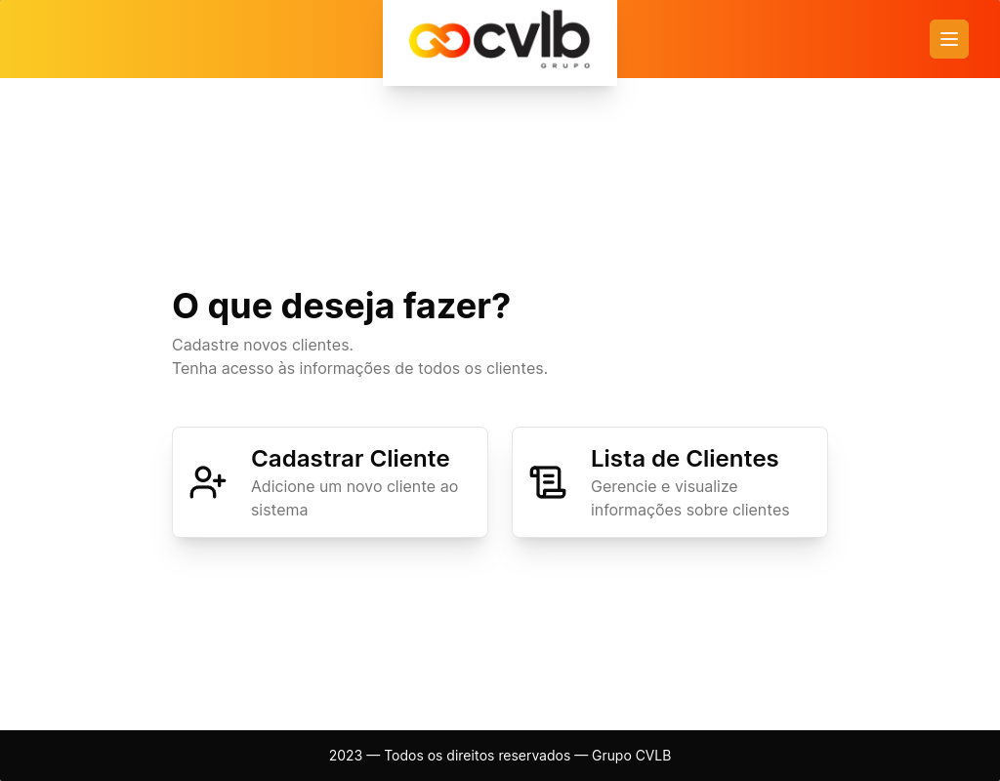
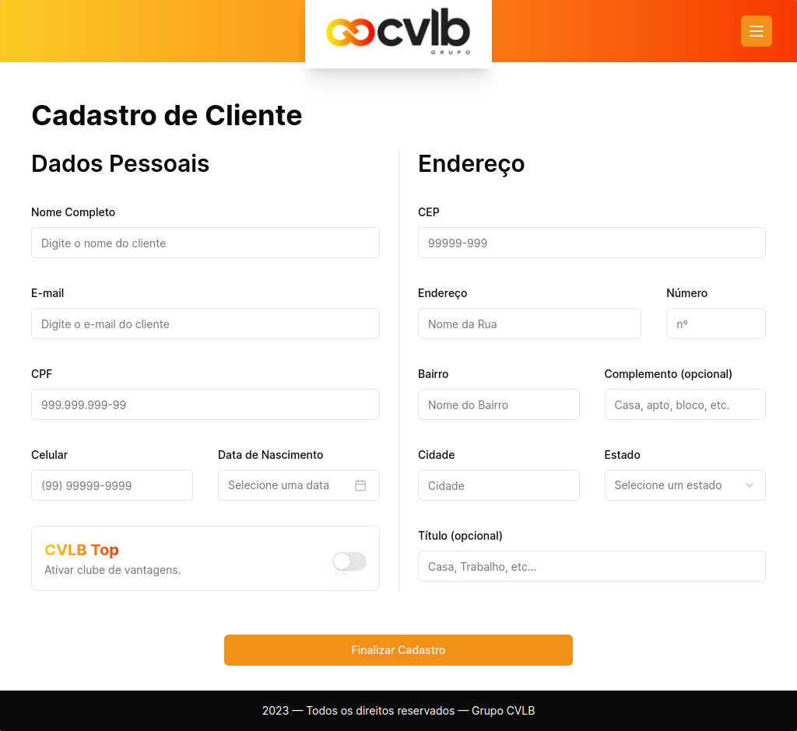
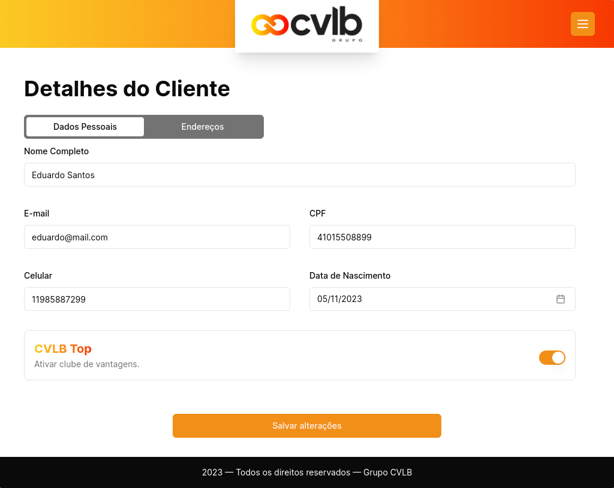
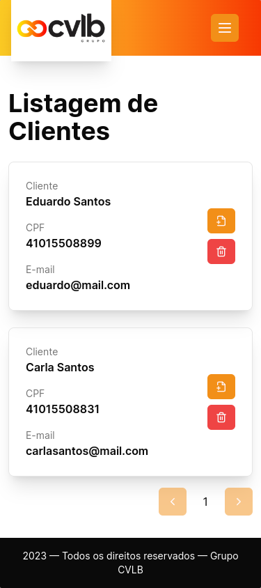
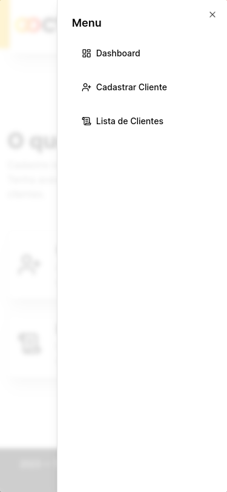

<!-- CABEÇALHO -->

    <h1>
        
    </h1>
    

        <a href="#%EF%B8%8F-sobre-o-projeto">Sobre o Projeto</a> •
        <a href="#-funcionalidades">Funcionalidades</a> •
        <a href="#-layout">Layout</a> •
        <a href="#%EF%B8%8F-tecnologias">Tecnologias</a> •
        <a href="#-autor">Autor</a>
    

<!-- SOBRE O PROJETO -->

## 🖥️ Sobre o Projeto

    
     
     
    

 

> Projeto desenvolvido como etapa do processo seletivo do Grupo CVLB.

Trata-se de uma aplicação funcional para gerenciar a base de clientes de uma loja fictícia.

Os objetivos a serem alcançados com a realização do projeto eram:

- Verificar as habilidades de resolução de problema;
- Compreender o raciocínio para se chegar em uma solução;
- Explorar e transmitir todo o conhecimento necessário.

<!-- FUNCIONALIDADES -->

## 💡 Funcionalidades

- [x] Tela Home
  - [ ] Login de funcionário
- [x] Tela "Dashboard"
  - [x] Menu para opções de funcionalidades do sistema
- [x] Tela de Cadastro de Cliente
  - [x] Formulário para cadastro de novo cliente
- [x] Tela de Listagem de Clientes
  - [x] Lista de todos os clientes
  - [x] Excluir cliente
  - [x] Paginação
  - [ ] Pesquisa de clientes
- [x] Tela de Detalhes do Cliente
  - [x] Exibição dos Dados Pessoais do cliente
  - [x] Atualização de Dados Pessoais do cliente
  - [x] Exibição de todo os Endereços do cliente
  - [x] Cadastro de novo Endereço para o cliente

<!-- LAYOUT -->

## 🎨 Layout

  

  

  

  

<!-- TECNOLOGIAS -->

## 🛠️ Tecnologias

Para o desenvolvimento desse projeto, as seguintes ferramentas foram utilizadas:

- **[React.js](https://pt-br.reactjs.org/)**
- **[Next.js](https://nextjs.org/)**
- **[TypeScript](https://www.typescriptlang.org/)**
- **[Tailwind](https://tailwindcss.com/)**
- **[Shadcn UI](https://ui.shadcn.com/)**
- **[React Query](https://tanstack.com/query/v3/)**
- **[Axios](https://axios-http.com/)**
- **[React Hook Form](https://react-hook-form.com/)**
- **[Zod](https://zod.dev/)**

## 👨‍💻 Autor

Marcos Kenji Kuribayashi

 

---

Desenvolvido por Marcos Kenji Kuribayashi 😉
